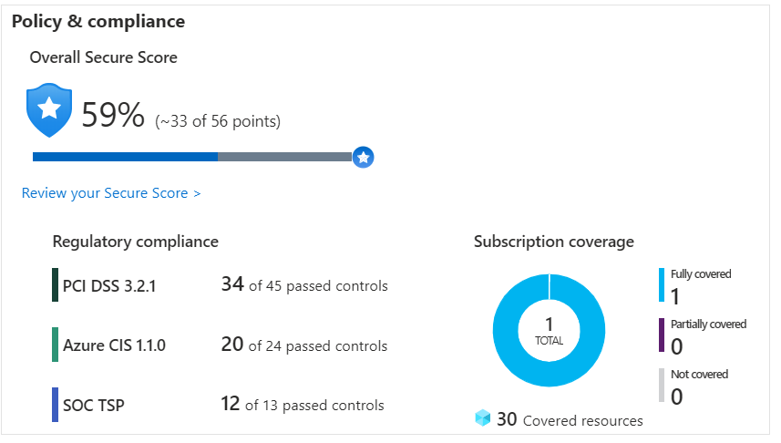
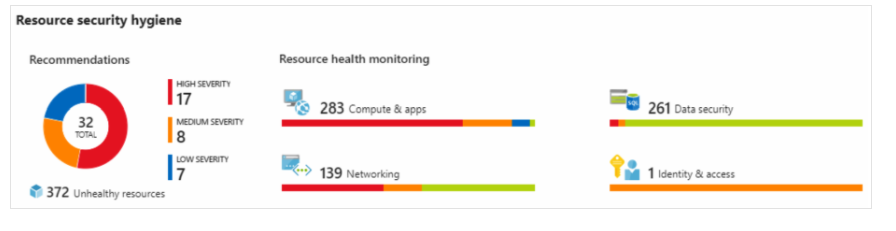
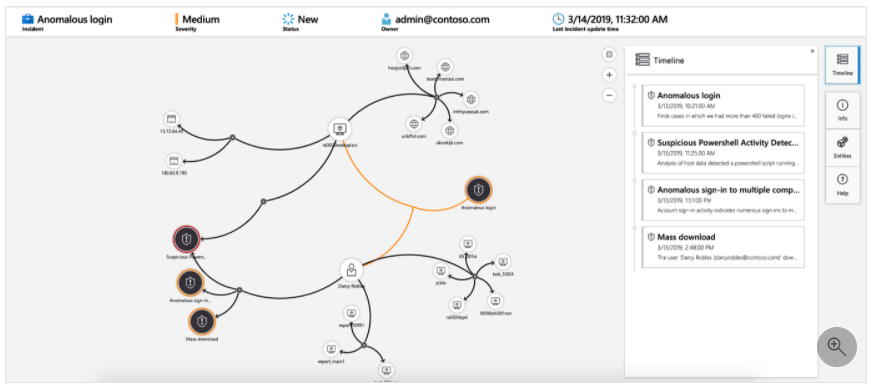

# Azure-Security-Strategy

## Azure Security Center

Azure Security Center is a monitoring service that provides visibility of your security posture across all of your services, both on Azure and on-premises. The term security posture refers to cybersecurity policies and controls, as well as how well you can predict, prevent, and respond to security threats.

It can:

- Monitor security settins across on-premises and cloud workloads.
- Automatically apply required security settins to new resources ans they come online.
- Provide security recommendations that are based on your current configurations, resources and networks.
- Continuously monitor your resources and perform automatic security assessments to identify potentials vulnerabilities before those vulnerabilities can be exploided.
- Us ML to detect and block malware from being installed on your virtual machines and other resources. You can also use adaptive application controls to define rules that list allowed applications to ensure that only applications you allow can run.
- Detect and analyze potential inbound attacks and investigate threats and any post-breach activity that might have occurred.
- Provide jus-in-time access control for network ports. Doing so reduces your attack surface by ensuring that the network only allows traffic that you require at the time that you need it to.
- Adaptive network hardening
- File integrity monitoring.

### Secure Score

Is a measurement of an organization's secuirty posture

Secure score is based on security controls, or groups of related security recommendations. Your score is based on the percentage of security controls that you satisfy. The more security controls you satisfy, the higher the score you receive. Your score improves when you remediate all of the recommendations for a single resource within a control.

### Respond to security alerts

Using Security Center centralized view of all its security alerts. From there, companies can dismiss false alerts, investigate them further, remediate alerts manually, or use and automated response with a workflow automation. (Azure Logic Apps and Security Center connectors). The logic app can be triggered by a threat detection alert or by a Security Center recommendation, filterd by name or severity. You can then configure the logic app to run an action, such as sending an email, or posting a message to a Microsoft Teams Channel.

## Azure Sentinel

Security management on a large scale can benefit from a dedicated security information and event management (SIEM) system. A SIEM system aggregates security data from many different sources (as long as those sources support an open-standard logging format). It also provides capabilities for threat detection and response.

Azure Sentinel is Microsoft's cloud-based SIEM system. It uses intelligent security analytics and threat analysis.

Capabilities:

- Collect cloud data at scale
- Detect previously undetected threats (Minimize false positives by using Microsoft's comprehensive analytics and threat intelligence.)
- Investigate threats with artificial intelligence (Examine suspicious activities at scale, tapping into years of cybersecurity experience from Microsoft)
- Respond to incidents rapidly. (Use built-in orchestration and automation of common tasks.)

### Connect your data sources

- **Connect Microsofte solutions**
provide real-time integration for services like Microsoft Threat Protection solutions, Microsoft 365 sources (including Office 365), Azure Active Directory, and Windows Defender Firewall
- **Connect other services and solutions** Connectors are available for common non-Microsoft services and solutions, including AWS CloudTrail, Citrix Analytics (Security), Sophos XG Firewall, VMware Carbon Black Cloud, and Okta SSO.
- **Connect industry-standard data sources.** Azure Sentinel supports data from other sources that use the Common Event Format (CEF) messaging standard, Syslog, or REST API.

### Detect threats

You can use oth built-in analytics and custom rules to detect threats.

Built in analytics use templates designed by Microsoft's team of security experts and analysts based on known threats, common attack vectors, and escalation chains for suspicious activity. These templates can be customized and search across the environment for any activity that looks suspicious. Some templates use machine learning behavioral analytics that are based on Microsoft proprietary algorithms.

Custom analytics are rules that you create to search for specific criteria within your environment. You can preview the number of results that the query would generate (based on past log events) and set a schedule for the query to run. You can also set an alert threshold.

### Investigate and respond

Sentinel provides with a graphical interface **investigation graph** - as shown below - allowing to review information from entities directly connected to the alert, and see common exploration queries to help quide the investigation.

You can use [Azure Monitor Workbooks](https://docs.microsoft.com/en-us/azure/azure-monitor/visualize/workbooks-overview) to automate responses to threaths. Here is an example

1. When the alert is triggered, open a ticket in the IT ticketing system.
2. Send a message to the security operations channel in Microsoft Teams or Slack to make sure the security analysts are aware of the incident.
3. Send all of the information in the alert to the senior network admin and to the security admin. The email message includes two user option buttons: Block or Ignore.
4. When an admin chooses **Block**, the IP address is blocked in the firewall, and the user is dissabled in Azure Active Directory. When and admin chooses **Ignore**, the aler is closed in  Azure Sentinel, and the incident is closed in the IT ticketing system.
5. The workbook continues to run after it receives a response form the admins.

## Azure Key Vault

Azure Key Vault is a centralized cloud service for storing an application's secrets in a single, central location. It provides secure access to sensitive information by providing access control and logging capabilities.

It can

- Manage secrets
- Manage envryption keys
- Mange SSL/TLS certificates
- Store secrets backed by hardware security model (HSMs)

The benefits of using Key Vault include:

- **Centralized application secrets** Centralizing the storage for your application secrets enables you to control their distribution, and reduces the chances that secrets are accidentally leaked.

- **Securely stored secrets and keys** Azure uses industry-standard algorithms, key lengths, and HSMs. Access to Key Vault requires proper authentication and authorization.

- **Access monitoring and access control**
By using Key Vault, you can monitor and control access to your application secrets.

- **Simplified administration of application secrets**
Key Vault makes it easier to enroll and renew certificates from public certificate authorities (CAs). You can also scale up and replicate content within regions and use standard certificate management tools.

- **Integration with other Azure services**
You can integrate Key Vault with storage accounts, container registries, event hubs, and many more Azure services. These services can then securely reference the secrets stored in Key Vault.

## Azure Dedicated Host

On Azure, virtual machines (VMs) run on shared hardware that Microsoft manages. Although the underlying hardware is shared, your VM workloads are isolated from workloads that other Azure customers run.

Some organizations must follow regulatory compliance that requires them to be the only customer using the physical machine that hosts their virtual machines. Azure Dedicated Host provides dedicated physical servers to host your Azure VMs for Windows and Linux.