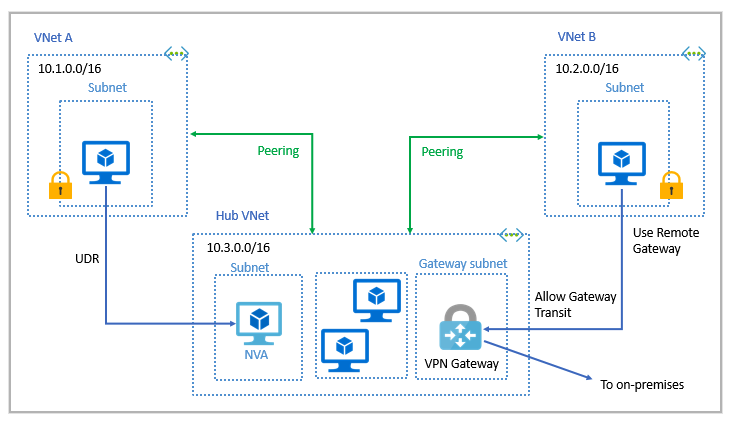

# Azure Networking Services

## Azure Virtual Network (VNETS)

Azure Virtual networks enable Azure resources, to communicate with each other, with users on the internet, and with your on-premises client computers.
Azure Virtual networks provide the following key netowrking capabilities

- Isolation and segmentation
- Internet communications
- Communicate between Azure resources
- Communicate with on-premises resources
-Route network traffic
- Filter network traffic
- Connect virtual networks

### Isolation and segmentation

Virtual Netowrk allows you to create multiple isolated virtual networks. You can define IP address space by using either public or Private IP address ranges. You can divide that IP address space into subnets and allocate part of the defined address space to each named subment. For Name resolution, you can use the name resolution services that's built in to Azure. You can also can configure the virtual network to use either an internal or an external DNS server.

### Internet communications

A VM in Azure can connect to the internet by default. You can enable incoming connections from the internet by defining a public IP address or a public load balancer. For VM management, you can connect via the Azure CLI, Remote Desktop Protocol or Secure Shell.

### Communication between Azure resources

you can enable Azure resources to communicate securely with each other using one of these two wyas:

- Virtual networks - can connct not only VMS but other Azure resources, such as the App Service Environment for Power Apps, Azure Kubernetes Service, and Azure virtual machine scale sets.
- Service endpoints - You can use service endpoints to connect to other Azure resource types, such as Azure SQL databases and storage accounts. This approach enables you to link multiple Azure resources to virtual networks to improve security an dprovide optimal routing between resources.

### Communication with on-premises resources

Azure VNETs enable you to link resources together in your on-premisies environment and within your Azure subscription. In effect, you can create a network that spans both your local and cloud environments. There are three mechanisms for you to set up this connectivity:

- **Point-to-site virtual private networks** - The typical approach to virtual private network (VPN) connection is from a computer outside your organization, back into your corporate network. In this case, the cluent computer initiates an encrypted VPN connection to connect that computer to the Azure virtual network.
- **Site-to-site virtual private networks** - links your on-premises VPN device or gateway to the Azure VPN gateway in a virtual network. In effect the devides in Azure can appear as being on the local network. Teh connection is encrypted and works over the internet.
- **Azure ExpressRoute** - For environments where you need greate bandwidth and higher level of security.

### Route network traffic

By default, Azure routes traffic between subnets on any connected virtual networks, on-premises networks, and the internet. You can control routing and override those settings, as follows:

- **Route tables** A route table allows you to define rules about how traffic should be directed. you can create custom route tables that control how packets are routed between subnets.
- **Border Gateway Protocol(BGP)** - works with Azure VPN gateways or ExpressRoute to propagate on-premises BGP routes to Azure Virtual networks.

### Filter network traffic

Azure virtual networks enable you to filter traffic between subnets by using the following approaches:

- **Network security groups** is an Azure resource that can contain multiple inbound and oubound security rules. you can define these rules to allow or block traffic, based on factors such as source and destination IP address, port and protocol.
- **Network virtual appliances** is a specialized VM that can be compared to a hardened network applicance. A network virtual applicance carries out a particular network function , such as running a firewall or performing wide area network (WAN) optimization.

## Connect virtual networks

You can link VNETs together by using virtual network peering. Peering enables resources in each virtual network to communicate with each other. These virtual networks can be in separate regions, which allows you to create a global interconnected network through Azure.

UDR is user-defined Routing. UDR is a significant update tto Azure's Virtual Networks as this allows network admins to control the routing tables between subnets within a VNet. as well as betwen VNets, therby allowing for greater control over network traffic flow.

## Azure VPN Gateway

VPNs use an encrypted tunnel within another network, tipically deployed to connect two or more trusted private networks to one another over an untrusted network (typically the public internet)

A VPN gateway is a type of virtual network gateway. Azure VPN Gateway instances are deployed in Azure Virtual Network instances and enable the following connectivity:

Connect on-premises datacenters to virtual networks through a site-to-site connection.
Connect individual devices to virtual networks through a point-to-site connection.
Connect virtual networks to other virtual networks through a network-to-network connection.

You can deploy only one VPN gateway in each virtual network, but you can use one gateway to connect to multiple locations, which includes other virtual networks or on-premises datacenters.

When deploying a VPN gateay, you specify the VPN type Policy-based VPN or Route-based VPN.
Both types use a pre-shared key as the only method of authentication, also both rely on Internet Key Exchange (IKE) in either verion 1 or version 2 and Internet Protocol Security (IPSec). IKE is use to set up a security association (an agreement of the encryption) between two endpoints. This association is then passed to the IPSec suite, which encrypts and decrypts data packets encapsulated in the VPN tunnel.

**Policy-based VPNs** Specify statically the IP address of packets that should be encrypted through each tunnel. This type of device evaluates every data packet against those sets of IP addresses to choose the tunnel where that packet is going to be sent through. Key features:

- Support for KEv1 only
- Use of static routing, where combinations of address prefixes from both networks control how traffic is encrypted and decrypted through the VPN tunnel. The source and destination of the tunneled networks are declared in the policy and don't need to be declared in routing tables.
- Must be used in specific scenarios that require them, such as for compatibility with legacy on-premises VPN devices.

**Route-based VPNs** If defining which IP addresses are behind each tunnel is too cumbersome, route-based gateways can be used. With route-bsed gateways, IPSec tunnels are modeled as a network interface or virtual tunnel interface. IP routing (either static routes or dynamic routing protocols) decides which one of these tunnel interfaces to use when sending each packet. Route-based VPNs are the preferred connection method for on-premises devices. They're more resilient to topology changes such as the creation of new subnets.

Use a route-based VPN gateway if you need:

- Connections between virtual networks
- Point-to-site connections
- Multisite connections
- Coexistence with an Azure ExpressRoute gateway

Key features:

- Supports IKEv2
- Uses any-to-any (wildard) traffic selectors
- Can use dynamic routing protocols, where routing/forwarding tables direct traffic to different IPSec tunnels In this case, the source and destination networks aren't statically defined as they are in policy-based VPNs or even in route-based VPNs with static routing. Instead, data packets are encrypted based on network routing tables that are created dynamically using routing protocols such as BGP

### VPN gateay sizes

SKU| Site-tosite/Network-to-network tunnels | Aggregate thourghput benchmark | Border Gateay Protocol Support
|---|---|---|---|
Basic**| Max: 10 | 100 Mbps | Not supported
VpnGw1/Az | Max: 30 | 650 Mbps | Supported
VpnGw2/Az | Max: 30 | 1 Gbps | Supported
VpnGw3/Az | Max: 30 | 1.25 Gbps | Supported

** Basic VPN should only be used for Dev/Test, workloads, Be aware that it's unsupported to migrate from Basic to upper VPN's type at a later time without having to remove the gateway and redeploy.

### High-availability scenarios

- **Active/Standby** (By default even if you see only one VPN gateway resource in Azure. Connections are interrupted during this failuver, but they're typically restored within a few secons for planned maintenance and within 90 seconds for unplanned disruptions.)
- **Active/Active**  With the introduction of support for the BGP routing protocol, you can also deploy VPN gateways in an active/active configuration. In this configuratio, you assign a unique public IP address to each instance. You then create separate tunnels from the on-premises device to each IP address. you can extend the HA by deploying an additional VPN device on-premises.
- **ExpressRoute failover** another option is to configure a VPN gateway as a secure failover path for ExpressRoute connections.
- **Zone-redundant gateways** In regions that support availability zones. VPN gateays and ExpressRoute gateways can be deployed in a zone-redundant configuration. This config brings resiliency, scalability and ahigher availability to virtual network gateways.

## ExpressRoute

ExpressRoute lets you extend your on-premises networks into the Microsoft cloud over a private connection with the help of a connectivity provider. With ExpressRoute, you can establish connections to Microsoft cloud services, such as Microsoft Azure and Microsoft 365.

Key Features

- Layer 3 connectivity between your on-premises network and the Microsoft Cloud through a connectivity provider. - Connectivity can be from an any-to-any (IPVPN) network, a point-to-point Ethernet connection, or through a virtual cross-connection via an Ethernet exchange.
- Connectivity to Microsoft cloud services across all regions in the geopolitical region.
- Global connectivity to Microsoft services across all regions with the ExpressRoute premium add-on.
- Dynamic routing between your network and Microsoft via BGP.
- Built-in redundancy in every peering location for higher reliability.
- Connection uptime SLA.
- QoS support for Skype for Business.

### ExpressRoute connectivity models

- CloudExchange colocation - Colocated providers can normally offer both Layer 2 and Layer 3 connections between your infrastructure, which might be located in the colocation facility, and the Microsoft cloud. For example, if your datacenter is colocated at a cloud exchange such as an ISP, you can request a virtual cross-connection to the Microsoft cloud
- Point-to-point Ethernet connection Point-to-point connections provide Layer 2 and Layer 3 connectivity between your on-premises site and Azure. You can connect your offices or datacenters to Azure by using the point-to-point links. For example, if you have an on-premises datacenter, you can use a point-to-point Ethernet link to connect to Microsoft
- Any-to-any connection With any-to-any connectivity, you can integrate your wide area network (WAN) with Azure by providing connections to your offices and datacenters. Azure integrates with your WAN connection to provide a connection like you would have between your datacenter and any branch offices.
With any-to-any connections, all WAN providers offer Layer 3 connectivity. For example, if you already use Multiprotocol Label Switching to connect to your branch offices or other sites in your organization, an ExpressRoute connection to Microsoft behaves like any other location on your private WAN.
