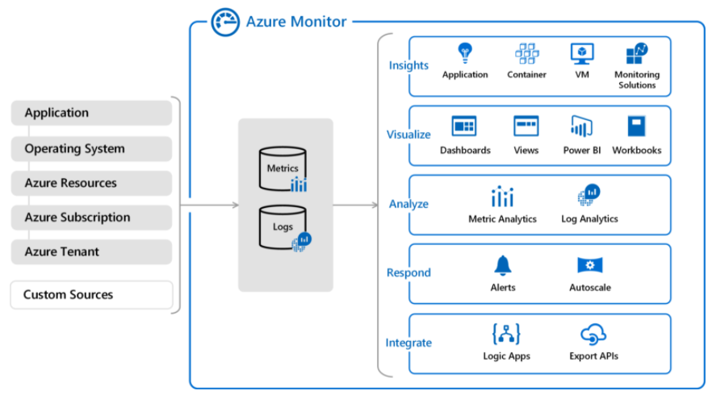

# Microsoft-Monitoring solutions

Basic questions or concerns companies using the cloud have:

- Are we using the cloud correctly? Can we squeeze more performance out of our cloud spend?
- Are we spending more than we need to?
- Do we have our systems properly secured?
- How resilient are our resources? If we experience a regional outage, could we fail over to another region?
- How can we diagnose and fix issues that occur intermittently?
- How can we quickly determine the cause of an outage?
- How can we learn about planned downtime?

## Azure Advisor

Azure Advisor evaluates your Azure resources and makes recommendations to help improve reliability, security, and performance, achieve operational excellence, and reduce costs. Advisor is designed to help you save time on cloud optimization. The recommendation service includes suggested actions you can take right away, postpone, or dismiss.

The recommendations are available via the Azure portal and the API, and you can set up notifications to alert you to new recommendations.

Recommendations are divided in five categories:

- **Reliability**: Ensure and improve the continuity of your business-critical applications
- **Security**: Detect threats and vulnerabilities that might lead to security breaches.
- **Performance**: Improve the speed of your applications.
- **Cost**: Optimize and reduce your overall Azure spending.
- **Operational Excellence**: Help you achieve process and workflow efficiency, resource manageability and deployment best practices.

## Azure Monitor

Azure Monitor is a platform for collecting, analyzing, visualizing, and potentially taking action based on the metric and logging data from your entire Azure and on-premises environment.

The following diagram illustrates just how comprehensive Azure Monitor is.

## Azure Service Health

Azure Service Health provides a personalized view of the health of the Azure services, regions, and resources you rely on. The status.azure.com website, which displays only major issues that broadly affect Azure customers, doesn't provide the full picture. But Azure Service Health displays both major and smaller, localized issues that affect you. Service issues are rare, but it's important to be prepared for the unexpected. You can set up alerts that help you triage outages and planned maintenance. After an outage, Service Health provides official incident reports, called root cause analyses (RCAs), which you can share with stakeholders.

Service Health helps you to keep an eye on several event types:

- **Service issues** problems in Azure, such as outages, that affect your right now. You can drill down to the affected services, regions, updateds from your engineering teams and find ways to share and track the lates information.

- **Planned maintenance** events cna affect your availability. Most of these events occur without any impact to you and aren't shown her. In the rare case that a reboot is rquired, Service Health allows you to choose when to perform the maintenance to minimize downtime.

- **Health advisories** issues that require you to act to avoid service interruption, including service retirements and breaking changes. Health advisories are announced far in advance to allow you to plan.
