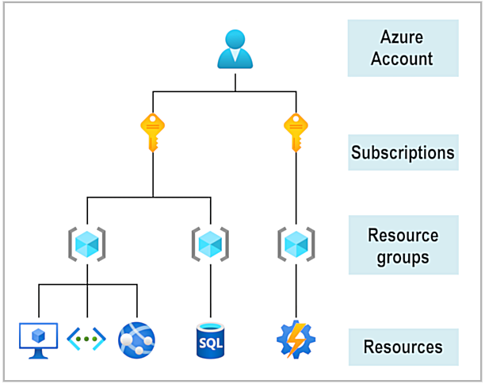
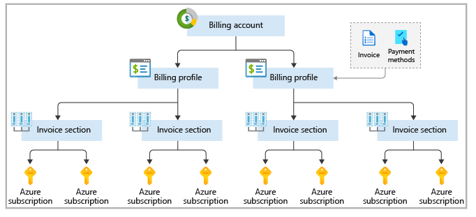
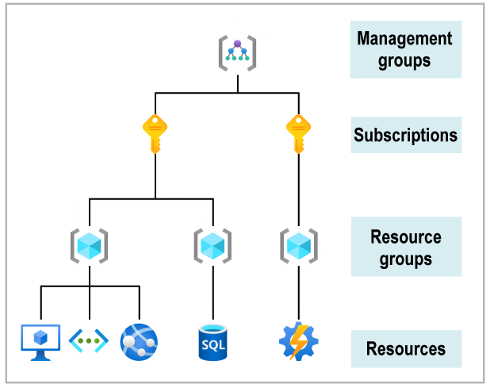
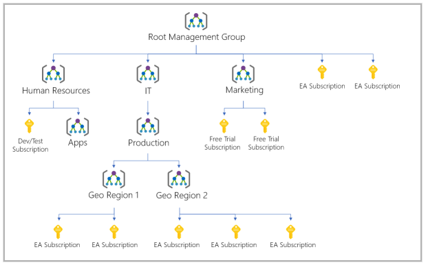
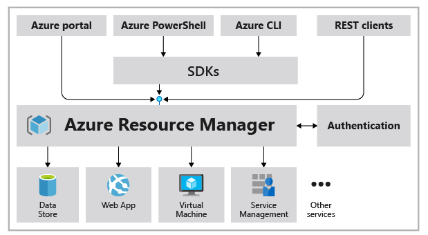

# Azure Cloud

This repo contains documentation to help you to ramp up your technical skills on Azure.

## Azure Accounts

To create and use Azure services, you need an Azure Subscription. When you create an Azure account a subscription will be created for you, then you can add more subscriptions as you need.

The following image describes the concept of Azure accounts and subscriptions

An account can have one subscription or multiple subscriptions that have different billing models and to which you apply different access-management policies. You can use Azure subscriptions to define boundaries around Azure products, services and resources. There are two type of subscription boundaries:

- Billing boundary: This subscription type determines how an Azure account is billed for using Azure.  You can create multiple subscriptions for different types of billing requirements. Azure generates separate billing reports and invoices for each subscription so that you can organize and manage costs.

- Access control boundary: Azure applies access-management policies at the subscription level, and you can create separate subscriptions to reflect different organizational structures.

### Customize billing to meet your needs

If you have multiple subscriptions, you can organize them into invoice sections. Each invoice section is a line item on the invoice that shows the charges incurred that month. For example, you might need a single invoice for your organization but want to organize charges by department, team, or project.

Depending on your needs, you can set up multiple invoices within the same billing account. To do this, create additional billing profiles. Each billing profile has its own monthly invoice and payment method.

## Fundamentals

- Resources: Instances of services that you create, like VMs, storage, or SQL databases.
- Resource Groups: Resources are combined into resource groups, which act as a logical container into which Azure resources lik web apps, databases and storage accounts are deployed and managed.
- Subscriptions: A subscription groups together user accounts and the resources that have been created by those user accounts. For each subscriptions, there are limits or quotas of the amount of resources that you can create and use. Organizations can use subscriptions to manage costs and the resources that are created by users, teams or projects.
- Management groups: These groups help you manage access, policy and compliance for multiple subscriptions. All subscriptions in a management group automatically inherit the conditions applied to the management group.

### Azure Management groups

If your org has many subscriptions, you might need a way to efficiently manage access, policies and compliance for those subscriptions. You organize subscriptions into containers called management groups and apply your governance conditions to the management groups. All subscriptions within a management groups automatically inherit the conditions applied to the management group. Mgmt groups give you enterprise-grade management at a large scale no matter what type of subscriptions you might have. All subscriptions within a single management group must trust the same Azure AD tenant.

Another scenario where you would use management groups is to provide user access to multiple subscriptions. By moving multiple subscriptions under that management group, you can create one role-based access control (RBAC) assignment on the management group, which will inherit that access to all the subscriptions. One assignment on the management group can enable users to have access to everything they need instead of scripting RBAC over different subscriptions.

### Azure Regions

A region is a geographical area on the planet that contains at least one but potentially multiple datacenters that are nearby and networked together with a low-latency network.

### Availability zones

Availability zones are physically separate datacenters within an Azure region. Each availability zone is made up of one or more datacenters equipped with independent power, cooling, and networking. An availability zone is set up to be an isolation boundary. If one zone goes down, the other continues working. Availability zones are connected through high-speed, private fiber-optic networks.

### Resource Group

REsource groups are also a scope for applying role-based access control (RBAC) permissions. By applying RBAC permissions to a resource group, you can ease administration and limit access to allow only what's needed.

### Azure Resource Manager

ARM is the deployment and management serivce for Azure. It provides a management layer that enables you to create, update, and delete resources in your Azure account. You use management features like access control, locks, and tags to secure and organize your resources after deployment.

- Manage your infrastructure through declarative templates rather than scripts. A Resource Manager template is a JSON file that defines what you want to deploy to Azure.
- Deploy, manage, and monitor all the resources for your solution as a group, rather than handling these resources individually.
- Redeploy your solution throughout the development life cycle and have confidence your resources are deployed in a consistent state.
- Define the dependencies between resources so they're deployed in the correct order.
- Apply access control to all services because RBAC is natively integrated into the management platform.
- Apply tags to resources to logically organize all the resources in your subscription.
- Clarify your organization's billing by viewing costs for a group of resources that share the same tag.
